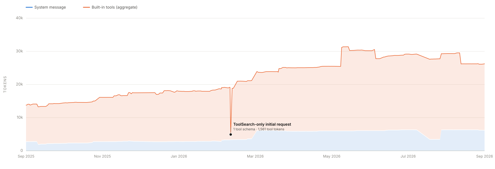
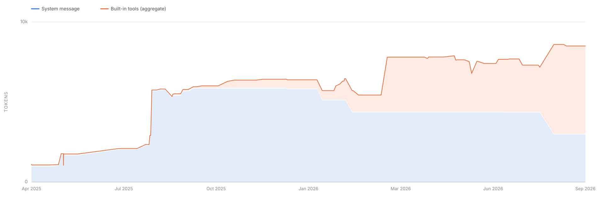

# AI Coding Harness System Prompts

An automatically updated, versioned archive of the system prompts and built-in tool surfaces of AI coding harnesses, with measured token counts and capture provenance for every release.

> Captured artifacts are provided for research and reference. The prompt content belongs to the respective vendors; no license is granted over it by this repository.

## Claude Code

505 versions · Feb 2025 – Sep 2026 · 26,233 combined tokens (latest)

<picture>
  <source media="(prefers-color-scheme: dark)" srcset="assets/claude-code-tokens-dark.svg">
  
</picture>

Each `claude-code/<version>/` directory holds `metadata.yml` (capture provenance, token measurement, and the built-in tool surface) plus one subdirectory per captured model variant, each with `systemprompt.txt` (the raw captured payload) and `systemprompt.md` (a rendered, browsable view).

## Codex

182 versions · Apr 2025 – Sep 2026 · 8,500 combined tokens (latest)

<picture>
  <source media="(prefers-color-scheme: dark)" srcset="assets/codex-tokens-dark.svg">
  
</picture>

Each `codex/<version>/` directory holds `metadata.yml` (capture provenance, token measurement, and the built-in tool surface) plus one subdirectory per captured model variant, each with `systemprompt.txt` (the raw captured payload) and `systemprompt.md` (a rendered, browsable view).

---

README and charts are regenerated automatically from the checked-in `metadata.yml` and `annotations.yml` files by `.github/workflows/generate-readme.yml`; edit those, not this file.
