# AI Coding Harness System Prompts

An automatically updated, versioned archive of the system prompts and built-in tool surfaces of AI coding harnesses, with measured token counts and capture provenance for every release.

> Captured artifacts are provided for research and reference. The prompt content belongs to the respective vendors; no license is granted over it by this repository.

## Claude Code

513 versions · Feb 2025 – Sep 2026 · 26,124 combined tokens (latest)

<picture>
  <source media="(prefers-color-scheme: dark)" srcset="assets/claude-code-tokens-dark.svg">
  
</picture>

Each `claude-code/<version>/` directory holds `metadata.yml` (capture provenance, token measurement, and the built-in tool surface) plus one subdirectory per captured model variant, each with `systemprompt.txt` (the raw captured payload) and `systemprompt.md` (a rendered, browsable view).

## Codex

186 versions · Apr 2025 – Sep 2026 · 8,500 combined tokens (latest)

<picture>
  <source media="(prefers-color-scheme: dark)" srcset="assets/codex-tokens-dark.svg">
  
</picture>

Each `codex/<version>/` directory holds `metadata.yml` (capture provenance, token measurement, and the built-in tool surface) plus one subdirectory per captured model variant, each with `systemprompt.txt` (the raw captured payload) and `systemprompt.md` (a rendered, browsable view).

## Model-family histories

Each chart uses the same stacked system-message and aggregate built-in-tool token format as the overviews. At every CLI package release, it selects the most recently API-released model in that successor lineage; a newer release immediately replaces its predecessor.

The horizontal timeline combines CLI package releases with dotted model API release markers. At a marker, an archived exact native system-message count for the new model and then-current CLI can anchor the blue series; the orange aggregate starts only when every built-in tool count is available. Historical recaptures describe the tested CLI/model pair, not actual model usage when the CLI shipped.

Missing or unavailable selected-model prompt measurements remain blank; exact native prompt counts remain visible when a partial measurement lacks one or more tool totals. The aggregate tool area breaks for those gaps, and the older model is never substituted. Those outcomes record a capture result, not proof that the model could never be captured, and their reason is preserved in that version's `metadata.yml` under `token_measurement`.

Model availability dates, explicit successor order, and source links live in [`tools/model-families.yml`](tools/model-families.yml). Uncataloged models get their own clearly labeled chart without a guessed release date.

### Claude Code

#### Opus

7 model releases · 5 with native system-message measurements during their release period

<picture>
  <source media="(prefers-color-scheme: dark)" srcset="assets/claude-code-opus-tokens-dark.svg">
  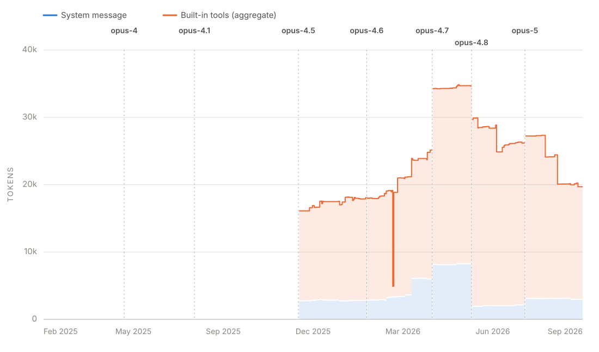
</picture>

#### Sonnet

5 model releases · 3 with native system-message measurements during their release period

<picture>
  <source media="(prefers-color-scheme: dark)" srcset="assets/claude-code-sonnet-tokens-dark.svg">
  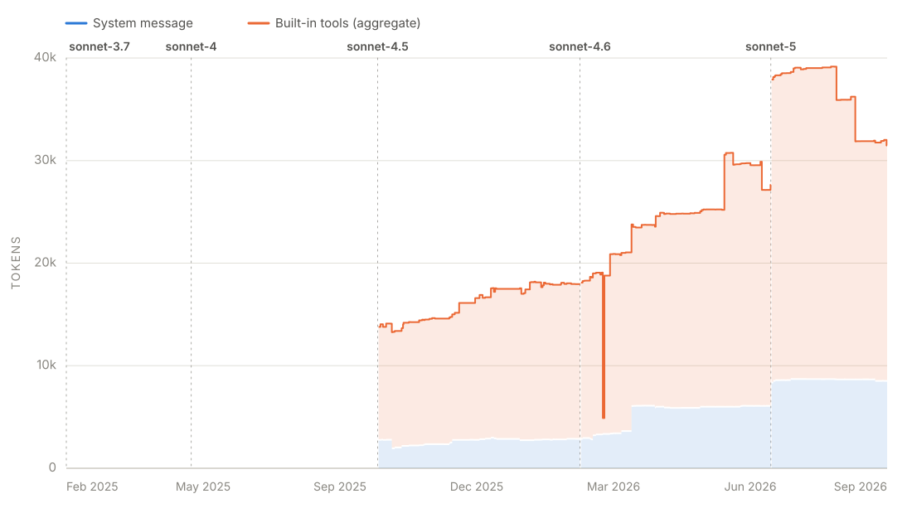
</picture>

#### Haiku

1 model release · 1 with native system-message measurements during their release period

<picture>
  <source media="(prefers-color-scheme: dark)" srcset="assets/claude-code-haiku-tokens-dark.svg">
  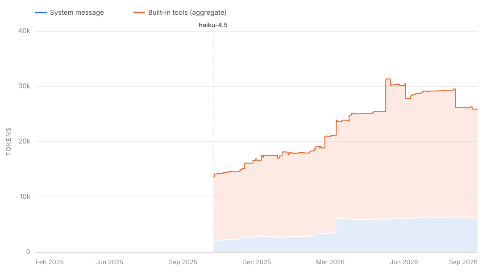
</picture>

#### Fable

2 model releases · 2 with native system-message measurements during their release period

<picture>
  <source media="(prefers-color-scheme: dark)" srcset="assets/claude-code-fable-tokens-dark.svg">
  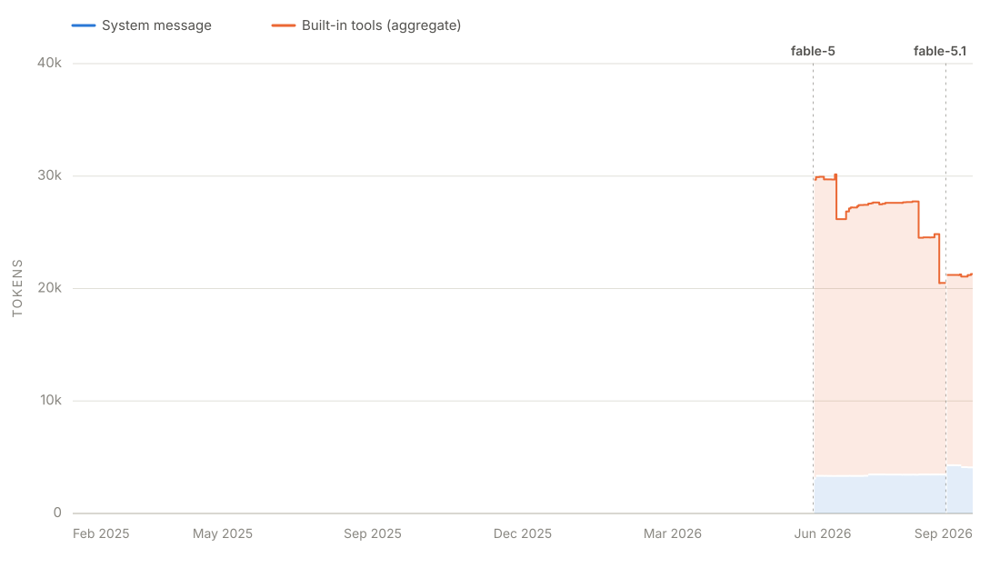
</picture>

### Codex

Parallel standard, mini, nano, Pro, Codex, and o-series tiers use separate charts so a same-day sibling release never appears to supersede another tier.

#### GPT standard

7 model releases · 7 with native system-message measurements during their release period

<picture>
  <source media="(prefers-color-scheme: dark)" srcset="assets/codex-gpt-standard-tokens-dark.svg">
  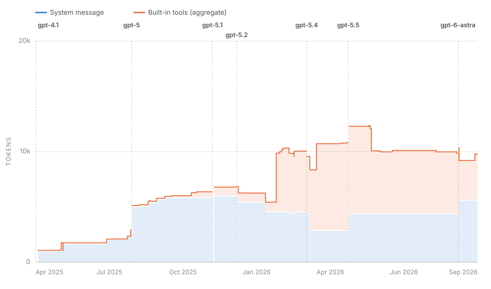
</picture>

#### GPT mini

3 model releases · 3 with native system-message measurements during their release period

<picture>
  <source media="(prefers-color-scheme: dark)" srcset="assets/codex-gpt-mini-tokens-dark.svg">
  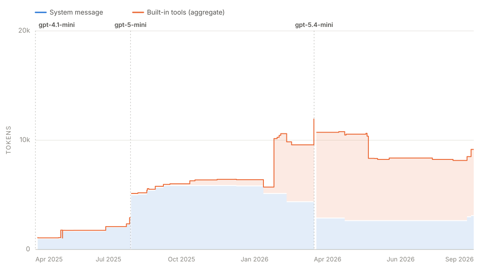
</picture>

#### GPT nano

3 model releases · 3 with native system-message measurements during their release period

<picture>
  <source media="(prefers-color-scheme: dark)" srcset="assets/codex-gpt-nano-tokens-dark.svg">
  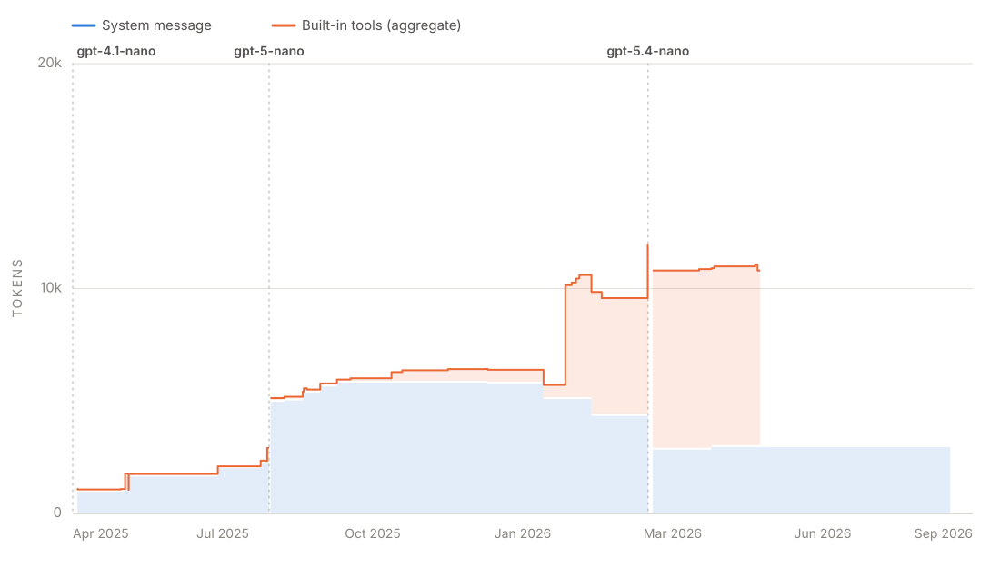
</picture>

#### GPT Pro

3 model releases · 3 with native system-message measurements during their release period

<picture>
  <source media="(prefers-color-scheme: dark)" srcset="assets/codex-gpt-pro-tokens-dark.svg">
  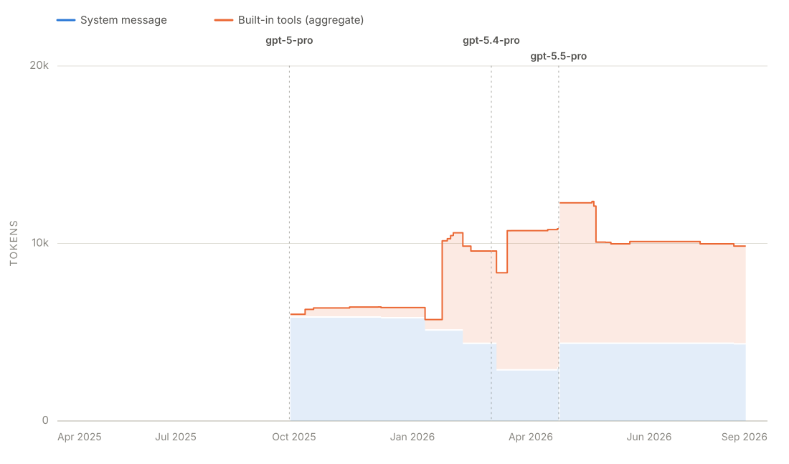
</picture>

#### GPT-5.6 Luna

1 model release · 1 with native system-message measurements during their release period

<picture>
  <source media="(prefers-color-scheme: dark)" srcset="assets/codex-gpt-luna-tokens-dark.svg">
  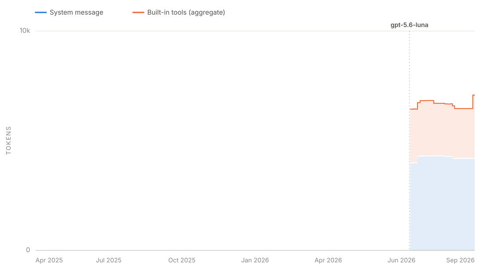
</picture>

#### GPT-5.6 Terra

1 model release · 1 with native system-message measurements during their release period

<picture>
  <source media="(prefers-color-scheme: dark)" srcset="assets/codex-gpt-terra-tokens-dark.svg">
  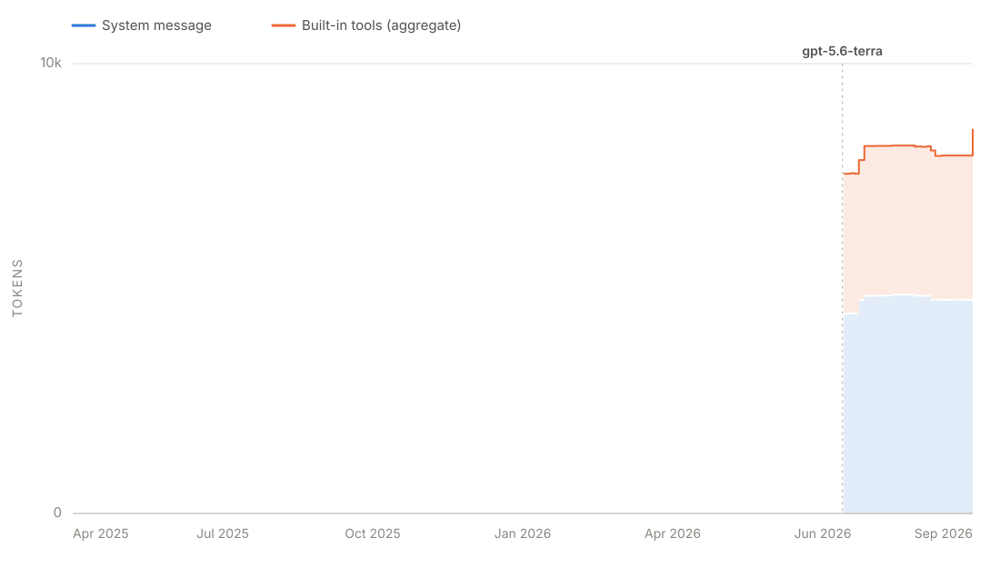
</picture>

#### Codex standard

5 model releases · 2 with native system-message measurements during their release period

<picture>
  <source media="(prefers-color-scheme: dark)" srcset="assets/codex-codex-standard-tokens-dark.svg">
  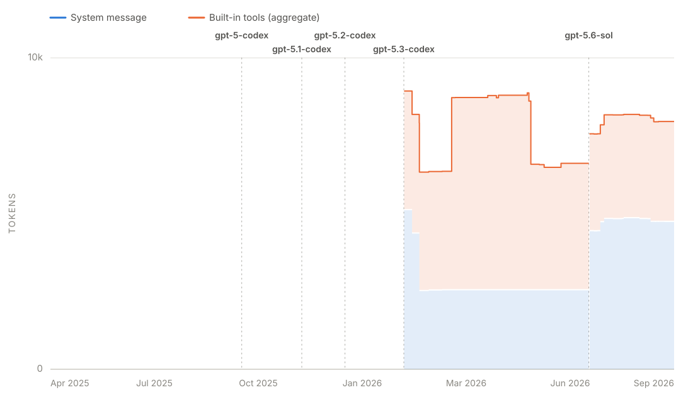
</picture>

#### Codex mini

2 model releases · 0 with native system-message measurements during their release period

<picture>
  <source media="(prefers-color-scheme: dark)" srcset="assets/codex-codex-mini-tokens-dark.svg">
  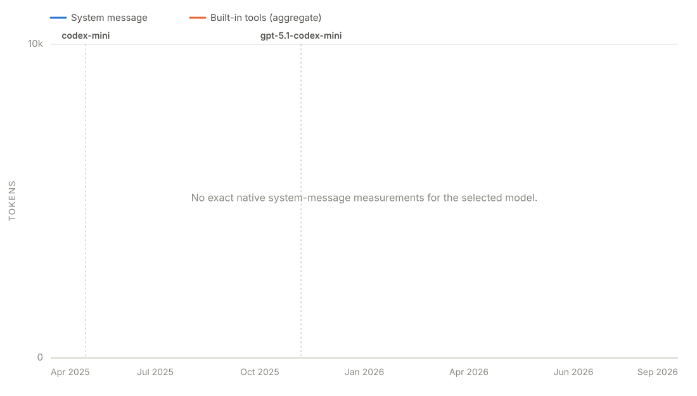
</picture>

#### Codex max

1 model release · 0 with native system-message measurements during their release period

<picture>
  <source media="(prefers-color-scheme: dark)" srcset="assets/codex-codex-max-tokens-dark.svg">
  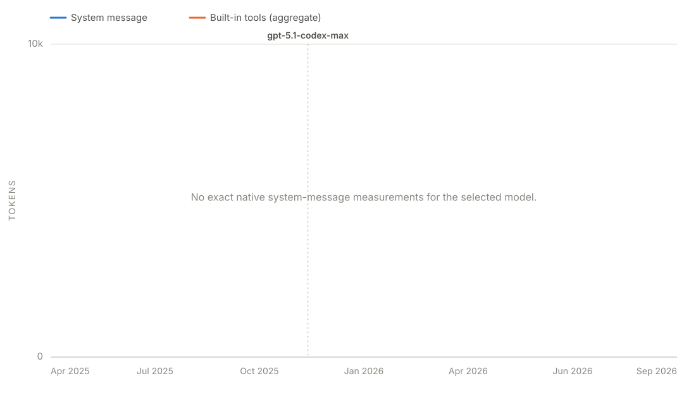
</picture>

#### o3

1 model release · 1 with native system-message measurements during their release period

<picture>
  <source media="(prefers-color-scheme: dark)" srcset="assets/codex-o3-tokens-dark.svg">
  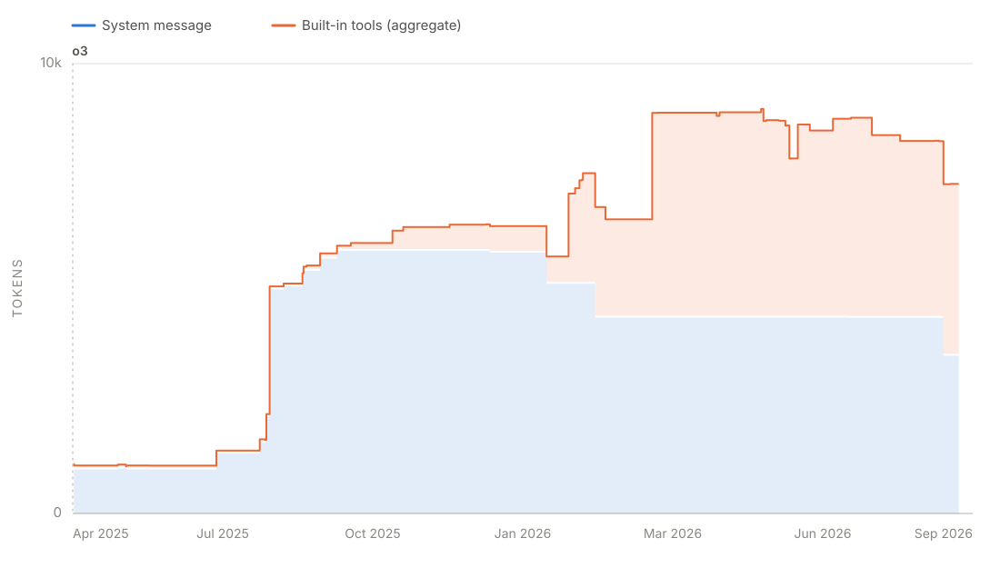
</picture>

#### o4-mini

1 model release · 1 with native system-message measurements during their release period

<picture>
  <source media="(prefers-color-scheme: dark)" srcset="assets/codex-o4-mini-tokens-dark.svg">
  
</picture>

#### o3 Pro

1 model release · 1 with native system-message measurements during their release period

<picture>
  <source media="(prefers-color-scheme: dark)" srcset="assets/codex-o3-pro-tokens-dark.svg">
  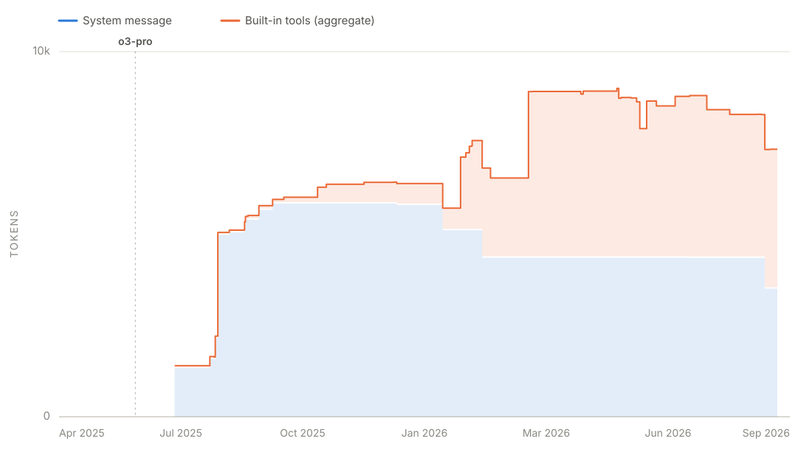
</picture>

---

README and charts are regenerated automatically from the checked-in `metadata.yml`, `annotations.yml`, and `tools/model-families.yml` files by `.github/workflows/generate-readme.yml`; edit those, not this file.
