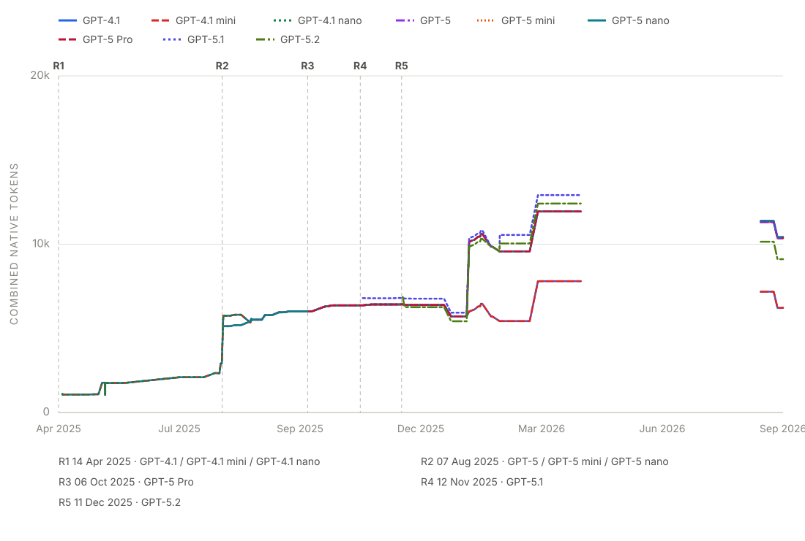
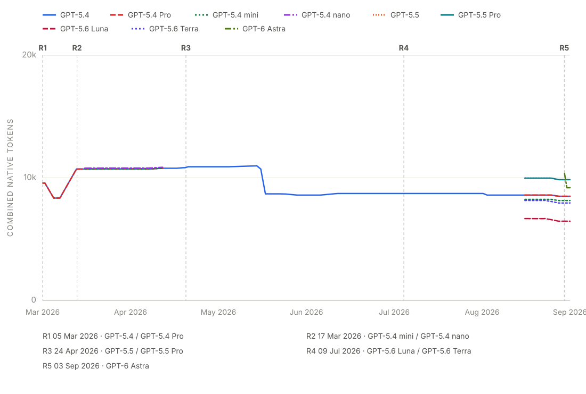
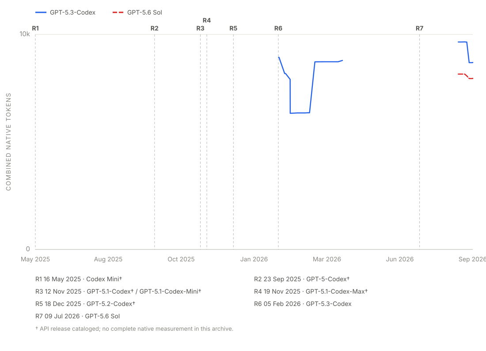
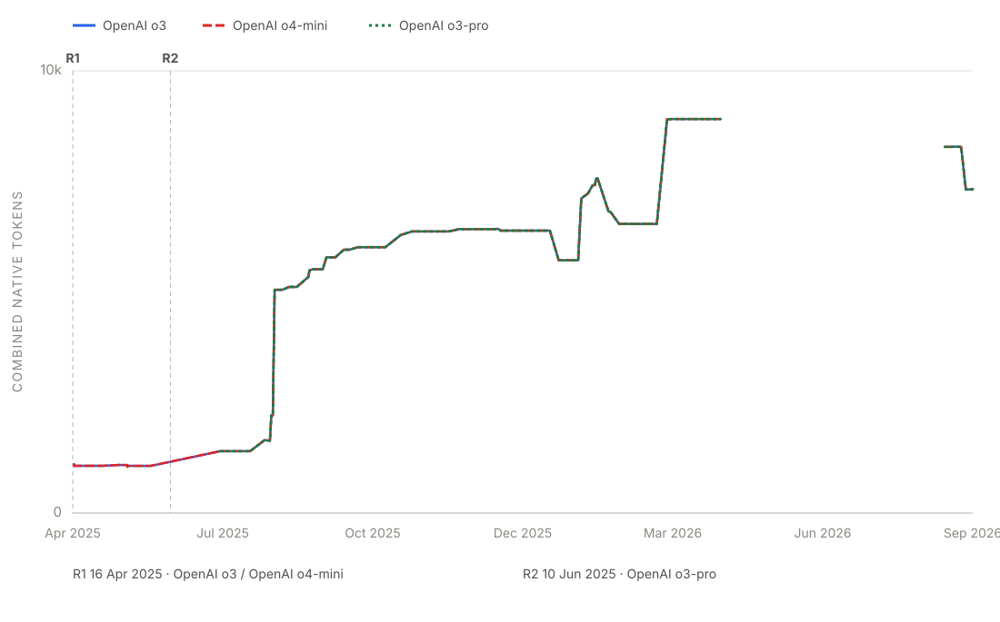

# AI Coding Harness System Prompts

An automatically updated, versioned archive of the system prompts and built-in tool surfaces of AI coding harnesses, with measured token counts and capture provenance for every release.

> Captured artifacts are provided for research and reference. The prompt content belongs to the respective vendors; no license is granted over it by this repository.

## Claude Code

507 versions · Feb 2025 – Sep 2026 · 26,234 combined tokens (latest)

<picture>
  <source media="(prefers-color-scheme: dark)" srcset="assets/claude-code-tokens-dark.svg">
  
</picture>

Each `claude-code/<version>/` directory holds `metadata.yml` (capture provenance, token measurement, and the built-in tool surface) plus one subdirectory per captured model variant, each with `systemprompt.txt` (the raw captured payload) and `systemprompt.md` (a rendered, browsable view).

### Model-family histories

Each line is the combined system-prompt and built-in-tool token count measured with that exact API model. The horizontal axis uses CLI package release dates when recorded; it falls back to capture time only when package release metadata is unavailable. Missing, unavailable, and partial measurements break the line rather than implying a total.

Historical CLI releases were often recaptured later. These lines show what a CLI version sent when tested with a model, not which model users ran when that CLI shipped; backfilled observations can therefore appear before the model's API release marker.

Release markers use the model's recorded API availability date. The reviewed dates and their sources live in [`tools/model-families.yml`](tools/model-families.yml); an uncataloged model remains visible but is labeled with an unknown release date.

#### Opus

7 cataloged or observed models · 5 with complete native measurements

<picture>
  <source media="(prefers-color-scheme: dark)" srcset="assets/claude-code-opus-tokens-dark.svg">
  
</picture>

#### Sonnet

5 cataloged or observed models · 3 with complete native measurements

<picture>
  <source media="(prefers-color-scheme: dark)" srcset="assets/claude-code-sonnet-tokens-dark.svg">
  
</picture>

#### Haiku

1 cataloged or observed model · 1 with complete native measurements

<picture>
  <source media="(prefers-color-scheme: dark)" srcset="assets/claude-code-haiku-tokens-dark.svg">
  
</picture>

#### Fable

2 cataloged or observed models · 2 with complete native measurements

<picture>
  <source media="(prefers-color-scheme: dark)" srcset="assets/claude-code-fable-tokens-dark.svg">
  
</picture>

## Codex

185 versions · Apr 2025 – Sep 2026 · 8,500 combined tokens (latest)

<picture>
  <source media="(prefers-color-scheme: dark)" srcset="assets/codex-tokens-dark.svg">
  
</picture>

Each `codex/<version>/` directory holds `metadata.yml` (capture provenance, token measurement, and the built-in tool surface) plus one subdirectory per captured model variant, each with `systemprompt.txt` (the raw captured payload) and `systemprompt.md` (a rendered, browsable view).

### Model-family histories

Each line is the combined system-prompt and built-in-tool token count measured with that exact API model. The horizontal axis uses CLI package release dates when recorded; it falls back to capture time only when package release metadata is unavailable. Missing, unavailable, and partial measurements break the line rather than implying a total.

Historical CLI releases were often recaptured later. These lines show what a CLI version sent when tested with a model, not which model users ran when that CLI shipped; backfilled observations can therefore appear before the model's API release marker.

Release markers use the model's recorded API availability date. The reviewed dates and their sources live in [`tools/model-families.yml`](tools/model-families.yml); an uncataloged model remains visible but is labeled with an unknown release date.

#### GPT 4.1–5.2

9 cataloged or observed models · 9 with complete native measurements

<picture>
  <source media="(prefers-color-scheme: dark)" srcset="assets/codex-gpt-4-1-to-5-2-tokens-dark.svg">
  
</picture>

#### GPT 5.4 and later

9 cataloged or observed models · 9 with complete native measurements

<picture>
  <source media="(prefers-color-scheme: dark)" srcset="assets/codex-gpt-5-4-to-6-tokens-dark.svg">
  
</picture>

#### Codex-tuned

8 cataloged or observed models · 2 with complete native measurements

<picture>
  <source media="(prefers-color-scheme: dark)" srcset="assets/codex-codex-tuned-tokens-dark.svg">
  
</picture>

#### o-series

3 cataloged or observed models · 3 with complete native measurements

<picture>
  <source media="(prefers-color-scheme: dark)" srcset="assets/codex-o-series-tokens-dark.svg">
  
</picture>

---

README and charts are regenerated automatically from the checked-in `metadata.yml`, `annotations.yml`, and `tools/model-families.yml` files by `.github/workflows/generate-readme.yml`; edit those, not this file.
